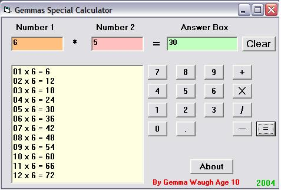



## my calculator

### Description

a calculator .

Its not the best one ever i know that .but it is my first time ever sending a program here . i dont expect lots of praise , but if someone can show me a beter way to do what i did i would be glad . i was told i should have used the select case for some parts but im sorry i didnt know how to.
 
### More Info
 
2 number inputs

it is not very hard to understand its not a super calculator but one i wanted to do to learn some things

returns answer based on what you selected +=/*

             |
---                |---
**Submitted On**   |2004-05-22 17:59:16
**By**             |[gemma](https://github.com/Planet-Source-Code/PSCIndex/blob/master/ByAuthor/gemma.md)
**Level**          |Beginner
**User Rating**    |5.0 (10 globes from 2 users)
**Compatibility**  |VB 5\.0, VB 6\.0
**Category**       |[Miscellaneous](https://github.com/Planet-Source-Code/PSCIndex/blob/master/ByCategory/miscellaneous__1-1.md)
**World**          |[Visual Basic](https://github.com/Planet-Source-Code/PSCIndex/blob/master/ByWorld/visual-basic.md)
**Archive File**   |[my\_calcula1748875222004\.zip](https://github.com/Planet-Source-Code/gemma-my-calculator__1-53948/archive/master.zip)

